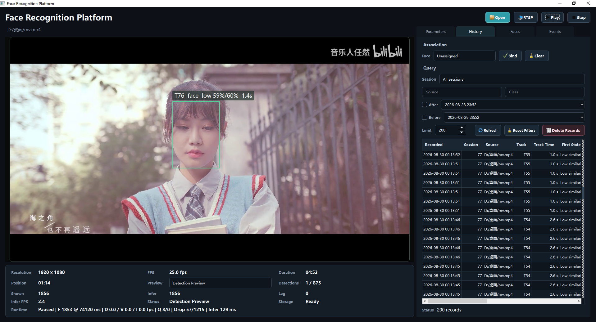
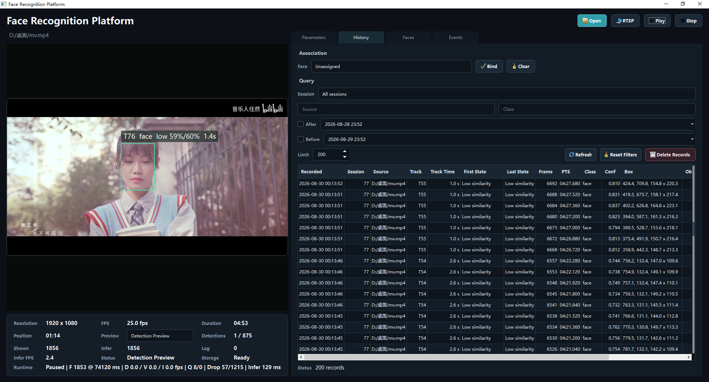
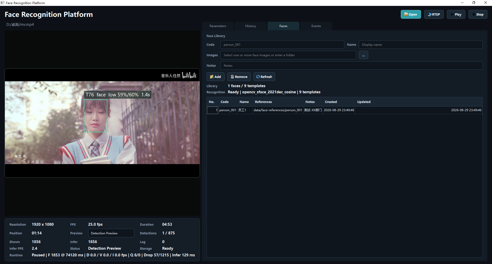
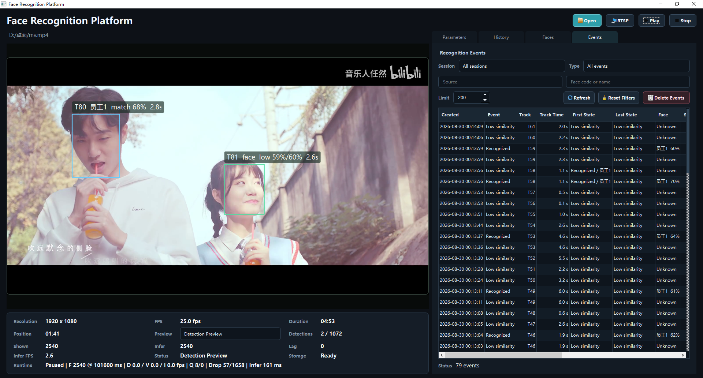

# 基于 Qt/C++ 的人脸检测识别平台

面向视频监控和人员管理场景，基于 `C++17 / Qt / FFmpeg / OpenCV DNN / SQLite` 实现人脸检测、身份识别、轨迹跟踪、事件分析和历史查询。

## 核心流程

```text
本地视频 / RTSP
    -> FFmpeg 解码
    -> 视频帧处理
    -> YOLO 人脸检测
    -> SFace 特征识别
    -> 人脸跟踪
    -> 识别事件去重
    -> SQLite 存储
    -> Qt 客户端展示
```

## 当前功能

- 支持本地视频文件和 RTSP 视频流。
- 支持视频播放、暂停、停止和 Detection Preview。
- 使用 YOLO ONNX 模型检测人脸，显示检测框和置信度。
- 使用 SFace ONNX 模型提取人脸特征并进行相似度匹配。
- 支持人员信息、人脸参考图和多张参考特征模板管理。
- 支持参考图人脸裁剪、识别可用性诊断和特征库模型指纹校验。
- 修改识别参数后，可自动重建参考人脸特征。
- 支持人脸跟踪，记录轨迹编号、持续时间、首个识别状态和最后识别状态。
- 支持轨迹级识别事件去重，减少连续视频帧产生的重复事件。
- 支持 Parameters、Faces、History、Events 页面。
- 支持 SQLite 历史记录查询和识别事件查询。
- 支持检测参数、识别参数和跟踪参数保存，并显示当前生效配置。

## 当前识别准确性

> 当前身份识别仍处于工程验证阶段，实际视频中的误识别和漏识别比较明显，暂不适合直接用于门禁、考勤或其他需要可靠身份核验的生产场景。

最可能的原因如下，按当前实现中的影响程度排序：

1. **缺少人脸关键点对齐**：当前 YOLO 检测器只输出人脸框，SFace 输入主要通过方形裁剪和缩放生成，还没有利用眼睛、鼻尖和嘴角关键点执行 `alignCrop()`。侧脸、低头和检测框偏移时，参考图与视频帧的人脸几何位置差异较大。
2. **参考样本覆盖不足**：每个人如果只有少量正脸图片，很难覆盖侧脸、表情、发型、眼镜和不同光照。虽然系统支持多张参考图，但仍需要为每个人准备质量稳定且具有姿态差异的样本。
3. **Similarity 和 Margin 未经过数据标定**：默认阈值只能作为模型参考值。阈值过低会把陌生人误认为库内人员，阈值过高会增加漏识别；人脸库身份较少时，最近邻候选更容易长期指向同一个人。
4. **参考图与视频质量差异较大**：视频压缩、运动模糊、逆光、遮挡、人脸尺寸过小以及摄像头角度变化都会降低 SFace 特征的一致性。
5. **检测框和 Padding 存在波动**：连续帧中的人脸框大小和位置会轻微变化，不合适的裁剪留白会混入头发、背景或丢失下巴、额头，导致同一个人的特征相似度不稳定。
6. **当前使用通用 SFace 模型**：模型没有针对本项目的视频来源、拍摄距离和目标人群进行业务数据微调，复杂场景下的区分能力有限。
7. **轨迹关联目前以几何信息为主**：多人靠近、交叉或短时遮挡时可能发生轨迹交换，使 Events 中的首末识别状态看起来像身份跳变。

后续改进重点是接入带五点关键点的人脸检测器、使用 `FaceRecognizerSF::alignCrop()` 做标准化对齐，建立真实视频验证集标定阈值，并加入质量筛选、轨迹内多帧投票和人脸特征辅助跟踪。

## Qt 界面

| 页面 | 功能 |
| --- | --- |
| Detection Preview | 播放视频并显示人脸框、识别结果、相似度和轨迹信息 |
| Parameters | 修改检测、识别和跟踪参数，查看生效状态 |
| Faces | 管理人员、参考图片和人脸特征模板 |
| History | 查询历史检测记录和人员关联信息 |
| Events | 查询去重后的人脸识别事件及轨迹状态 |

## 界面截图

### 主界面


### Detection Preview



### History



### Faces



### Events



## 模型文件

```text
models/yolov8-face/face.onnx
models/yolov8-face/labels.txt
models/face-recognition-sface/face_recognition_sface_2021dec.onnx
```

YOLO 模型负责定位人脸，SFace 模型负责提取人脸特征。更换检测模型、识别模型或影响裁剪结果的参数后，需要重新构建参考特征模板。
