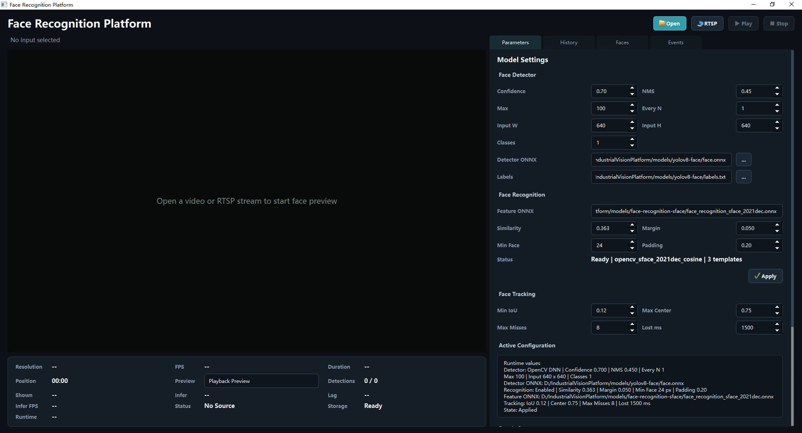

# 基于 Qt/C++ 的人脸检测识别平台

面向视频监控和人员管理场景，基于 `C++17 / Qt / FFmpeg / OpenCV DNN / SQLite` 实现人脸检测、特征识别、跟踪和事件管理。

## 核心流程

```text
本地视频 / RTSP
    -> FFmpeg 解码
    -> 视频帧处理
    -> YOLO 人脸检测
    -> SFace 特征识别
    -> 人脸跟踪
    -> 识别事件去重
    -> SQLite 存储
    -> Qt 客户端展示
```

## 当前功能

- 支持本地视频文件和 RTSP 视频流。
- 支持视频播放、暂停、停止和 Detection Preview。
- 使用 YOLO ONNX 模型检测人脸，显示检测框和置信度。
- 使用 SFace ONNX 模型提取人脸特征并进行相似度匹配。
- 支持人员信息、人脸参考图和多张参考特征模板管理。
- 支持参考图人脸裁剪、识别可用性诊断和特征库模型指纹校验。
- 修改识别参数后，可自动重建参考人脸特征。
- 支持人脸跟踪，记录轨迹编号、持续时间、首个识别状态和最后识别状态。
- 支持轨迹级识别事件去重，减少连续视频帧产生的重复事件。
- 支持 Parameters、Faces、History、Events 页面。
- 支持 SQLite 历史记录查询和识别事件查询。
- 支持检测参数、识别参数和跟踪参数保存，并显示当前生效配置。

## Qt 界面

| 页面 | 功能 |
| --- | --- |
| Detection Preview | 播放视频并显示人脸框、识别结果、相似度和轨迹信息 |
| Parameters | 修改检测、识别和跟踪参数，查看生效状态 |
| Faces | 管理人员、参考图片和人脸特征模板 |
| History | 查询历史检测记录和人员关联信息 |
| Events | 查询去重后的人脸识别事件及轨迹状态 |

## 界面截图

截图请放入：

`docs/images/qt-ui/`

### 主界面

文件：`docs/images/qt-ui/main-window.png`



### Detection Preview

文件：`docs/images/qt-ui/detection-preview.png`

> 待补充截图：将图片保存为 `docs/images/qt-ui/detection-preview.png` 后，取消下面这行的注释。
>
> ``

### History

文件：`docs/images/qt-ui/history-query.png`

> 待补充截图：将图片保存为 `docs/images/qt-ui/history-query.png` 后，取消下面这行的注释。
>
> ``

### Faces

文件：`docs/images/qt-ui/faces-library.png`

> 待补充截图：将图片保存为 `docs/images/qt-ui/faces-library.png` 后，取消下面这行的注释。
>
> ``

### Recognition 状态

文件：`docs/images/qt-ui/recognition-ready.png`

> 待补充截图：将图片保存为 `docs/images/qt-ui/recognition-ready.png` 后，取消下面这行的注释。
>
> ``

## 模型文件

```text
models/yolov8-face/face.onnx
models/yolov8-face/labels.txt
models/face-recognition-sface/face_recognition_sface_2021dec.onnx
```

YOLO 模型负责定位人脸，SFace 模型负责提取人脸特征。更换识别模型后，需要重新导入参考图片并重建特征模板。
